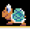
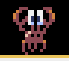

# Mario-Python
A Super Mario Bros–style platformer built with Python. **It was developed as a final project for the subject Programming in Universidad Carlos III de Madrid.**

This game includes an initial screen which serves as a in-game presentation.  When playing, several levels are showcasted containing a variety of enemies(koopas, craps and flies).

This project was implemented by **Pedro Díaz Balvin and Miguel Amiel Gil.**

## Implementation

We used Pyxel, a retro engine library for Python that allowed us to use our OOP knowledge to program the game.

The project includes different modules, each of them focused on a specific in-game functionality.

To develop the maps and characters, we have used sprites found on the Internet and shared in class. Then we developed the different maps by hand by using the tilemap editor from Pyxel.

All the information about Pyxel can be found here:
[Pyxel](https://pypi.org/project/pyxel/)

## Installation/Setup

To play the game, you must clone the project and open it in your preferred Python IDE(Pycharm is recommended).

Afterwards, you must create a virtual environment to handle the project and install the Pyxel library. 
To do so you can run:

1. **Creating the virtual environment**

    python -m venv .venv

2. **Activating the environment**

**Windows**: .\.venv\Scripts\activate
**Linux/MacOS**: source .venv/bin/activate

3. Install the dependencies

pip install -r requirements.txt

You can finally run the project by running the line:
python3 Main.py

OR by going to the Main.py module in your IDE and running it

## Mechanics

In the game, there are 3 types of enemies: koopas, crabs and flies, each of them with their own characteristics.
1. **Koopas**: most basic enemy, it has one life.

2. **Crabs**: second enemy type, it has two lives and when getting hit change colours.

3. **Flies**: third enemy type, it has one life and the ability to jump.

To defeat these enemies, two techniques can be followed:

### 1.Knocking them down
  1. Jumping towards the enemy from below, hitting the tubes to knock them down(these will be notified by changing the tube's sprite).
  2. Hitting the POW block which knocks down all the enemies that were in contact with the ground at that time.

### 2. Finishing the enemy off
**Once the enemies are knocked down you have a fixed amount of time to kill them by walking through them.** If you do not success in killing an enemy, they will empower, increasing their speed.

The player controls **Mario** who moves with **W(jump)**, **A(left)**, **D(right)**. 

The main objective is to complete the 4 levels of the game, getting as many points as possible. Points are given by collecting coins and by defeating the different enemies.

As previously stated, there are four levels:
**Level 1**: presents the koopa enemy.
**Level 2**: showcasts the crab enemy.
**Level 3**: the fly is introduced.
**Level 4**: a level that combines all the previous enemies to test the knowledge the player has adquired through the game.

**Beware** -> Levels 1-3 require to defeat 5 enemies to move to the next level. Nonetheless, to finish the game and succesfully pass the final level(level 4) you must defeat 10 enemies.
